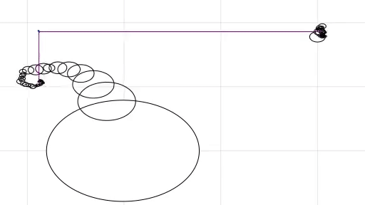
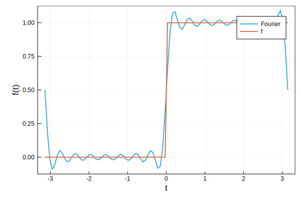
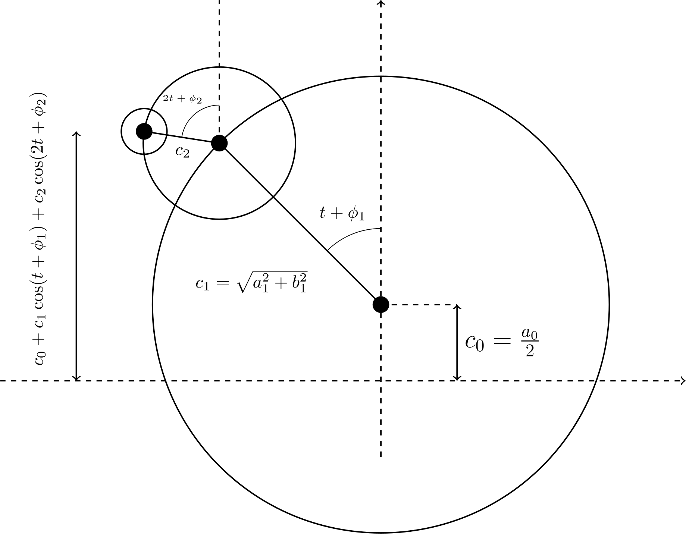
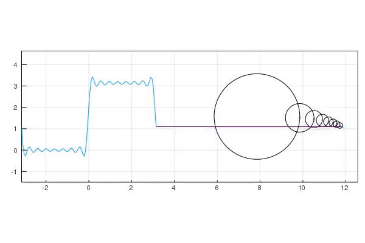

Its fall again and I'm TAing PHYS 116C (for the third time). The first topic of PHYS 116C is Fourier series. So, naturally, I thought I'd make a post about Fourier series. At some point, I stumbled acrossed [this](https://www.youtube.com/watch?v=Mm2eYfj0SgA) video by `The Coding Train`. In this post, I'd like to replicate what the `The Coding Train` did, but in more generality, i.e. for a general Fourier series. I will focus on periodic functions on the interval $(-\pi, \pi)$ for simplicity (one can easily modify what I write to accomidate more general intervals). I will also be using `Julia`, but the code can be easily adapted to any language (but at some put you'll need a plotting library, so I'd say `Julia`, `python` or `Mathematica` is the way to go.)

# Fourier Series
The concept of Fourier series is incredibly useful for many fields in science,
ranging from math, to physics, to engineering. As a physicist, I use Fourier
series almost every day (mostly in infinite period limit, i.e. the Fourier
transform, but thats a topic for a later day.) The goal of a Fourier series is
to decompose a periodic function into a countably infinite number of sines and
cosines with varying frequencies. This can be done for any piecewise continuous
function over the real or complex numbers. Given some piecewise continuous
function, $f(t)$, over the real numbers, which is periodic over the interval
$(-\pi,\pi)$, we can write down its Fourier series as:
$$
\begin{align}
f(t) &= \dfrac{a_{0}}{2} + \sum_{n=1}^{\infty}a_{n}\cos(nt)  + \sum_{n=1}^{\infty}b_{n}\sin(nt)
\end{align}
$$
where $a_{0}, a_{n}$ and $b_{n}$ are the **Fourier** coefficients. It is
straight forward to compute these coefficients using a technique known as
*Fourier's trick*. The idea is to realize that sine and cosines with different
frequencies are orthogonal over the interval $(-\pi,\pi)$ (i.e. if you integrate
the product of a sine and/or cosine of different frequencies of ($-\pi,\pi$) you
get zero). For example,
$$
\dfrac{1}{\pi}\int_{-\pi}^{\pi}\cos(nt)\cos(mt) = \begin{cases} 0 & n\neq m\\\\
1 & n=m
\end{cases}
$$
Similar identities hold for other combinations of sines and cosines. If we use this orthogonality of sines and cosines, we can integrate both sides of the definition of the Fourier series to isolate the $a_{n}$'s and $b_{n}$'s. The results are:
$$\begin{align}
a_{n} &= \dfrac{1}{\pi}\int_{-\pi}^{\pi}f(t)\cos(nt)dt, &
b_{n} &= \dfrac{1}{\pi}\int_{-\pi}^{\pi}f(t)\sin(nt)dt
\end{align}$$
Given these simple formulas, we can then easily compute Fourier series of any function we might like. Before doing so, I'd like to present an alternate form of the real Fourier series consisting of just cosines (which will be useful for us later on). To get rid of the sines, one can make use of the following identity:
$$\begin{align}
c_{n}\cos(nt + \phi_{n}) &= a_{n}\cos(nt) + b_{n}\sin(nt)\\\\
c_{n} &= \sqrt{a_{n}^2 + b_{n}^2}\\\\
\phi_{n} &= -\tan^{-1}(b_{n}/a_{n})
\end{align}$$
(this is easiest to prove using complex exponentials.) Then, we can write down the Fourier series as:
$$\begin{align}
f(t) &= \sum_{n=0}^{\infty}c_{n}\cos(nt + \phi_{n})
\end{align}$$
with $c_{0} = a_{0} / 2$ and $\phi_{0} = 0$.


Before moving onto the main topic, let's write some code to compute Fourier series. I will be using `Julia` (since its the best), but the reader can easily adapt the code to their favorite programing language.

First, let's create a Julia `struct` for representing the Fourier series of a function:
```julia
struct FourierSeries
    a0::Float64
    ans::Array{Float64, 1}
    bns::Array{Float64, 1}
end
```
Let's also create a constructor that will take in a function and return a filled `FourierSeries` object. To do this, we will need to compute some integrals. We will use the `QuadGK` library to do this (you can install via `Pkg.add("QuadGK")`):
```julia
using QuadGK

"""
    FourierSeries(f; N=10)

Generate a FourierSeries object containing the the first `N` (excluding a0)
Fourier coefficients of the function `f` over the interval (-π, π).
"""
function FourierSeries(f::Function; N::Int=10)
    a0::Float64 = quadgk(t-> f(t), -π, π)[1] / π
    ans = Array{Float64, 1}(undef, N)
    bns = Array{Float64, 1}(undef, N)
    for n in 1:N
        ans[n] = quadgk(t-> f(t) * cos(n * t), -π, π)[1] / π
        bns[n] = quadgk(t-> f(t) * sin(n * t), -π, π)[1] / π
    end
    FourierSeries(f, a0, ans, bns)
end
```
Calling `FourierSeries(f)` will return a `FourierSeries` object with the first 10 Fourier coefficients computed. Likewise, `FourierSeries(f; N=100)` would compute the first 100 Fourier coefficients. We will also what to be able to evaluate the Fourier series at a given time. Thus, to avoid explicitly writing the sum everytime, let's write a function to do this:
```julia
"""
    eval(t, fs::FourierSeries)

Evaluate the Fourier series `fs` at the time `t`.
"""
function eval(t::Float64, fs::FourierSeries)
    fs.a0 / 2 + sum(fs.ans[n] * cos(n * t) + fs.bns[n] * sin(n * t)
                    for n in 1:length(fs.ans))
end
```
For convinience, we also make a vectorized function:
```julia
function eval(ts::AbstractRange, fs::FourierSeries)
    [eval(t, fs) for t in ts]
end
```
which can take in a range of times and return an array of the Fourier series evaluated at those times. Now, we can go nuts and compute the Fourier series for any function we wish. For example, we can compute the Fourier series of the step function:
```julia
# step function: zero for t < 0 and π for t > 0.
f(t) = t < 0 ? 0.0 : π;
fs = FourierSeries(f)
# Plot it!
using Plots;
ts = LinRange(-π, π, 100);
plot(ts, eval(ts, fs), linewidth=1.5, label="Fourier", framestyle=:box)
plot!(ts, [f(t) for t in ts], linewidth=2, label="f")
ylabel!("f(t)")
xlabel!("t")
```


# Fourier Circles
If you've ever taken a physics course, you've likely encountered the simple harmonic oscillator (SHO). The motion of a SHO is described by the form $x(t) = A\cos(\omega t + \phi_{0})$, where $A$ is the amplitude of the oscillator, $\omega$ is the angular frequency and $\phi_{0}$ is the initial phase angle. You may have also be taught that you can visualize the motion of the oscillator as the projection of a point moving along a circle onto the "x" axis (if you haven't seen this, you will soon!) We'd like to take this idea one step further. Because, a Fourier series is like a sum of an infinite number of SHO, each oscillating with a different frequency.

Let's condier the Fourier series we defined above, which we write down again here:
$$\begin{align}
f(t) &= \sum_{n=0}^{\infty}c_{n}\cos(nt + \phi_{n})
\end{align}$$
The first term (the $n=0$ term) is just a constant shift. The second term is where things start to get interesting, $c_{1}\cos(t+\phi_1)$. If you remember back to the "unit-circle", this is the horizontal component of a line from the center of a circle of radius $c_{1}$ to the edge of the circle. The angle this line makes with the horizontal axis is $t + \phi_1$. Similarly, the third term, $c_{2}\cos(2t+\phi_2)$ is again the horizontal component of a line, but of a circle of radius $c_2$ and with an angle $2t+\phi_2$. Now, if we add the first three terms:
$$\begin{align}
c_0 + c_1\cos(t+\phi_1) + c_2\cos(2t+\phi_2)
\end{align}$$
what we get can be interpreted as follows. Consider the following figure:



This figure contains a set of circles to guide the eye along with a set of line connecting the centers of the circles. Here we have only drawn three circles, but one can imagine continuing drawing more and more. Each line drawn in this figure has a length equal to the radius of the corresponding circle, $c_n$, and makes an angle with respect to the verticle axis of $nt + \phi_n$. Consider now, the final height of the tip of the final line. It is simply
$$\begin{align}
c_0 + c_1\cos(t+\phi_1) + c_2\cos(2t+\phi_2) + c_3\cos(3t+\phi_3) + \cdots
\end{align}$$
which is exactly the Fourier series. What we have done is gave a geometric interpretation of the Fourier series: the Fourier series is just an inifinte set of circles arranged in a funny way. We take a circle centered at ($x=0$,$y=c_0$) of radius $c_1$, then add another circle of radius $c_2$ centered at the edge of the first at an angle $t + \phi_1$, etc.. Then, the height of the center of the final circle represents the Fourier series. Note that the angles here depend on time. Therefore, all of the circles will rotate as time evolves.

This is cute and all, but let's see it in action:



Now, I'd like to explain how this was made. We will use a slightly different example just so we can see more pretty pictures. In order to make the above gif, what we need to do is first construct the `FourierSeries` object. Let's do this for a function that is:
$$\begin{align}
f(t) &= \begin{cases}
t + \pi & t < 0\\
\pi & t > 0\\
\end{cases}
\end{align}$$
To construct this object, we use:
```julia
f(t) = t < 0 ? t + π : π
fs = FourierSeries(f)
```
Next, we will want to make a gif. This is done by using the `@gif` macro in `Julia` (in `python` you can use matplotlib and its `animation` module. See [this](https://jakevdp.github.io/blog/2012/08/18/matplotlib-animation-tutorial/) for a good explaination). The `@gif` macro takes in a `for` loop as its argument. That is, we use:
```julia
nframes = 1500
@gif for i = 1:nframes
    # code to make plots here...
end every 10
```
This will make a gif for every 10 of the plots you constructed in the `for` loop (see [this](http://docs.juliaplots.org/latest/#simple-is-beautiful-1) for more information.) Inside our `for` loop we'd first like to just plot the Fourier series. But we would like to evolve it through time. We can do so using:
```julia
# Plot window will always be -π → π
ts = range(-π, stop = π, length = 50);
@gif for i = 1:1500
    shift = i / 100 # time shift
    plot(
        ts, # horizontal plot windows
        [eval(t + shift, fs) for t in ts], # Fourier series values
        ylims = (-1.5, π + 1.5), # fix window height
        legend = false, # let's not go for legend
        xlims = (-π, 4π), # we make some extra room for later
        framestyle = :box, # because you've got to have a frame
        aspect_ratio = 1 # so the circles look like circles and not ellipses
    )
end every 10
```
This will draw the Fourier series as a "traveling wave" (think of a window of width ($-\pi$,$\pi$) moving to the right.) Now comes the hard part. We would like to draw the circles similar to how we drew them before. First, let's make a circle maker:
```julia
"""
    circle(x, y, r)

Construct x and y positions of a cicle of radius `r` centered at (`x`, `y`).
"""
function circle(x, y, r)
    θ = LinRange(0.0, 2π, 500)
    x .+ r * sin.(θ), y .+ r * cos.(θ)
end
```
This function will create $x$ and $y$ arrays for a circle centered at $(x,y)$ with radius $r$. We can draw the base circle, which is centered at $(0,c_0)$ using the following:
```julia
@gif for i = 1:1500
    # other code...
    x, y = (2.5π, fs.a0 / 2)
    r = sqrt(fs.ans[1]^2 + fs.bns[1]^2)
    ϕ = -atan(fs.bns[1], fs.ans[1])
    plot!(
        circle(x, y, r),
        seriestype = [:shape,],
        linecolor = :black,
        c = :white,
        legend = false
    )
end every 10
```
Note that we shifted the circles center to be at $x=2.5\pi$. This is so it is out of the way of the plot of the Fourier series. Now, we would like to add on more circles. The centers of the next circle will be at $(x + c_1\sin(t + \phi_1), y + c_1\cos(t + \phi_1))$. In fact, each successive circle will be located at the previous $(x,y)$ but shifted by $(c_n\sin(nt + \phi_n), c_n\cos(nt + \phi_n))$. Let's write an internal `for` loop to draw all the circles:
```julia
@gif for i = 1:1500
    # other code...
    t = ts[end] + shift # get the final time
    for i = 2:length(fs.ans)
        x += r * sin((n - 1) * t + ϕ)
        y += r * cos((n - 1) * t + ϕ)
        # compute new radius and angle
        r = sqrt(fs.ans[n]^2 + fs.bns[n]^2)
        ϕ = -atan(fs.bns[n], fs.ans[n])
        plot!(
            circle(x, y, r),
            seriestype = [:shape,],
            linecolor = :black,
            c = :white,
            legend = false,
            fillalpha = 0.0
        )
    end
end every 10
```
This will draw all of the circles. Lastly, we would like to draw a line connecting the center of the final circle to the final time of the Fourier series plot. This can be done using:
```julia
@gif for i = 1:1500
    # other code...
    t = ts[end] + shift # get the final time
    for i = 2:length(fs.ans)
        # code...
    end
    x += r * sin(length(fs.ans) * (ts[end] + shift) + ϕ)
    y += r * cos(length(fs.ans) * (ts[end] + shift) + ϕ)
    interps = range(ts[end], stop = x, length = 50)
    plot!(interps, [y for _ in interps], color = :purple)
end every 10
```
And that's it. If we put everything together, the final code is:
```julia
@gif for i = 1:1500
    shift = i / 100 #
    plot(
        ts,
        [eval(t + shift, fs) for t in ts],
        ylims = (-1.5, π + 1.5),
        legend = false,
        xlims = (-π, 4π),
        framestyle = :box,
        aspect_ratio = 1
    )
    x = 2.5π
    y = fs.a0 / 2
    r = sqrt(fs.ans[1]^2 + fs.bns[1]^2)
    ϕ = -atan(fs.bns[1], fs.ans[1])
    plot!(
        circle(x, y, r),
        seriestype = [:shape,],
        linecolor = :black,
        c = :white,
        legend = false
    )
    t = ts[end] + shift
    for n = 2:length(fs.ans)
        x += r * sin((n - 1) * t + ϕ)
        y += r * cos((n - 1) * t + ϕ)
        r = sqrt(fs.ans[n]^2 + fs.bns[n]^2)
        ϕ = -atan(fs.bns[n], fs.ans[n])
        plot!(
            circle(x, y, r),
            seriestype = [:shape,],
            linecolor = :black,
            c = :white,
            legend = false,
            fillalpha = 0.0
        )
        scatter!([x], [y], markersize = 0.3)
    end
    x += r * sin(length(fs.ans) * (ts[end] + shift) + ϕ)
    y += r * cos(length(fs.ans) * (ts[end] + shift) + ϕ)
    scatter!([x], [y], markersize = 0.1)
    interps = range(ts[end], stop = x, length = 50)
    plot!(interps, [y for _ in interps], color = :purple)
end every 10
```
Note that I have added some code to plot the centers of the circles using `scatter!([x], [y], markersize = 0.3)`. Running the code will produce the following:


As a final note, I'll explain how I made the gif displaying "Physics 116C" at the top of this post. What I did was plot digitize the text for "Physics 116C" using [this](https://automeris.io/WebPlotDigitizer/). Using the data that I extracted from the webplot digitizer, I constructed linear interpolating functions for the $x$ and $y$ data. Then, I constructed Fourier series for $x$ and $y$ functions and essentially repeated what I showed above.